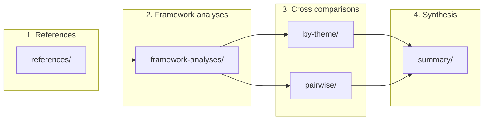

# ADR-2026-01-30-01: Documentation Structure

- **Date:** 2026-01-30
- **Status:** Accepted

## Context

The project compares three framework families (spec-kit, BMAD, OpenSpec) for
spec-driven development. We need a documentation layout that:

- Stores cloned reference repositories as analysis sources.
- Holds per-framework analyses (documents, glossaries, descriptions, summaries).
- Supports cross-framework analyses (by theme or pairwise) and a global summary.

The structure must be easy to navigate and scalable as content grows.

## Decision

We adopt a **two-tree documentation layout** under `docs/`:

1. **references/** — Cloned repos (spec-kit, BMAD, OpenSpec) used as sources.
2. **framework-analyses/** — One subdirectory per framework family. Each family
   has four subfolders: `documents/`, `glossaries/`, `descriptions/`, `summary/`.
3. **cross-analyses/** — Cross-framework work: `documents/`, `by-theme/`,
   `pairwise/` (spec-kit vs BMAD, spec-kit vs OpenSpec, BMAD vs OpenSpec), and
   `summary/`.

Directory layout (plaintext tree):

```plaintext
docs/
├── README.md
├── adr/
│   ├── INDEX.md
│   ├── TEMPLATE.md
│   └── YYYY-MM-DD-NN-*.md
├── references/
│   └── (cloned repos: spec-kit, BMAD, OpenSpec)
├── framework-analyses/
│   ├── spec-kit/
│   │   ├── documents/
│   │   ├── glossaries/
│   │   ├── descriptions/
│   │   └── summary/
│   ├── bmad/
│   │   ├── documents/
│   │   ├── glossaries/
│   │   ├── descriptions/
│   │   └── summary/
│   └── openspec/
│       ├── documents/
│       ├── glossaries/
│       ├── descriptions/
│       └── summary/
└── cross-analyses/
    ├── documents/
    ├── by-theme/
    ├── pairwise/
    │   ├── spec-kit-bmad/
    │   ├── spec-kit-openspec/
    │   └── bmad-openspec/
    └── summary/
```

## Intended Workflow

Content is produced in four stages. Each stage feeds the next:

1. **References** — Clone and update the reference repos in `references/`. They
   are the primary sources for all analyses.
2. **Framework analyses** — For each family (spec-kit, BMAD, OpenSpec), fill
   `documents/` (sources, notes), `glossaries/` (terms, taxonomies),
   `descriptions/` (processes, artifacts), and `summary/` (conclusions).
3. **Cross-framework comparisons** — Using the framework-specific content,
   write comparisons in `cross-analyses/documents/`, then either in
   `by-theme/` (e.g. concepts, workflows) or in `pairwise/` (one subfolder per
   pair of frameworks).
4. **Synthesis** — Consolidate findings in `cross-analyses/summary/` to
   produce cross-cutting conclusions and recommendations.



## Rationale

- **references/** as a single place for clones keeps sources explicit and
  updatable (e.g. `git pull`).
- A **per-family tree** with fixed subfolders (documents, glossaries,
  descriptions, summary) gives a consistent place for raw material, taxonomies,
  descriptions, and conclusions for each framework.
- **cross-analyses/** separates cross-cutting work from family-specific content;
  `by-theme/` and `pairwise/` support both thematic and pairwise comparisons.
- A single **summary** folder in each tree makes it clear where to find
  high-level conclusions.

## Consequences

### Positive

- Clear separation between sources, per-framework analysis, and cross-framework
  analysis.
- Same structure for all three families simplifies navigation and tooling.
- Workflow (references → specific → cross → summary) is documented and
  repeatable.
- English folder names improve accessibility for international contributors.

### Negative

- Directory depth increases; READMEs and `docs/README.md` are needed to orient
  readers.

## Alternatives Considered

- **Single flat docs/** — Rejected: too crowded once we have many frameworks and
  cross-analyses.
- **One tree with "by family" and "by theme" only** — Rejected: pairwise
  comparisons (e.g. spec-kit vs BMAD) are easier to manage in a dedicated
  `pairwise/` structure.
- **Separate repo per framework** — Rejected: cross-analyses and summary would
  require cross-repo workflows; a single repo keeps everything in one place.

## Related / Supersedes

- [docs/README.md](../README.md) — Documentation index and workflow.
- No prior ADR; this is the first.

## Document History

| Date       | Author | Change                                                           |
|------------|--------|------------------------------------------------------------------|
| 2026-01-30 | —      | Initial ADR, Accepted                                            |
| 2026-01-30 | —      | Renamed directories from French to English                       |
| 2026-01-30 | —      | Plaintext tree instead of Mermaid; workflow section with diagram |
